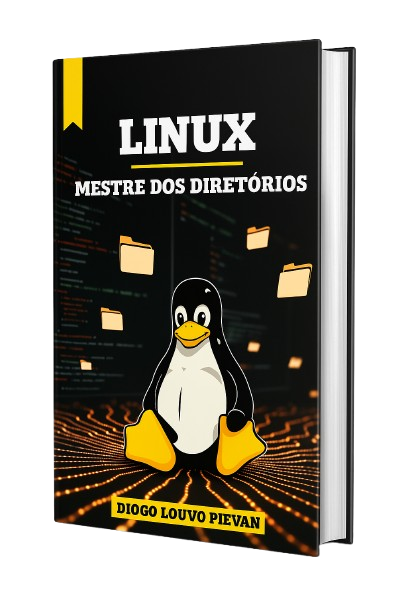

    

-------

# Projeto EBOOK Gerado por I.A.s

 > ℹ️ **NOTE:** Este é o repositório desenvolvido durante o curso no qual fui instrutor técnico na plataforma da [DIO](https://dio.me)

Projeto com o objetivo de gerar um ebook digital com as facilidades das ferramentas de IA. todos os prompts
seguem abaixo.

<a href="https://github.com/diogolpievan/prompts-recipe-to-create-a-ebook/blob/main/output/ebook-linux%20diretorios.pdf" title="View PDF now"> 📕Clique aqui para ler</a>

## 💻 Tecnologias utilizadas no projeto

- [ChatGPT](https://chat.openai.com/) 
- [Leonardo.ai](https://leonardo.ai)
- [Canva](https://www.canva.com)

## 🧠 Prompts

ChatGPT：

|   Ação   | prompt                                                                                                                                                                                                                                                                         |
| :------: | ------------------------------------------------------------------------------------------------------------------------------------------------------------------------------------------------------------------------------------------------------------------------------ |
|  título  | crie um titulo para um ebook sobre manipulação de diretorios no sistema linux, o nicho do ebook é programação e o subnicho é sistemas linux, o título deve ser épico e curto e tenha tematicas nerds, me liste 5 variações de titulos.                                                      |
| conteúdo | faça um texto para ebook, com foco em manipulação de diretorios no sistema LINUX, listando os principais Comandos com exemplos em código 
{REGRAS}> Explique sempre de uma maneira simples; > Deixe o texto enxuto; > Sempre traga exemplos de código em contextos reais; > sempre deixe um título sugestivo por tópico; |

Leonardo.ai：

|  Ação  | prompt                                                                                 |
| :----: | -------------------------------------------------------------------------------------- |
| título | A conceptual, high-resolution digital illustration featuring Tux, the iconic Linux penguin, standing heroically in the center of a vast digital environment. The color palette should be strictly black, white, and yellow, creating a strong visual contrast. Around Tux, abstract directory paths branch out like a glowing network. In the background, a beautifully designed terminal window is displayed prominently, with stylized shell commands and file structures visible on the screen. The atmosphere should evoke a sense of power, control, and open-source mastery — combining minimalist hacker aesthetics with a sleek, modern feel. Integrate elements like floating folders, symbolic links, or command lines to reinforce the directory theme|

## ✨ Features

- Conteúdo gerado via ChatGPT
- Imagens geradas via Leonardo.ai

## 📚 Materiais

- Imagens utilizadas em `assets`
- ebook gerado durante as aulas em `output`

## 🛠️ Instruções de execução

Utilize os prompts acima nas ferramentas sugeridas para gerar o material base e utilize uma ferramenta de edição de documentos como power point, libreoffice , indesign para diagramação.

## 👨‍💻 Expert

    
    
&nbsp&nbsp&nbspDiogo Louvo Pievan 
    &nbsp&nbsp&nbsp
    <a href="https://github.com/diogolpievan">
    GitHub</a>&nbsp;|&nbsp;
    <a href="www.linkedin.com/in/diogolpievan">LinkedIn</a>
&nbsp;|&nbsp;
&nbsp;|&nbsp;

  

---

⌨️ com 💜 por [Diogo Louvo Pievan](https://github.com/diogolpievan)
